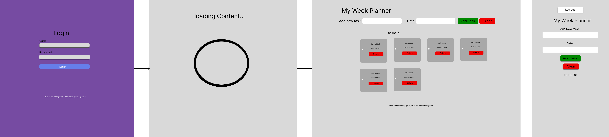

# UCD JavaScript Project – Interactive To-Do List

## Concept

This is a simple, interactive **To-Do List web app** built using HTML, CSS, and JavaScript. It starts with a **login screen**, and after entering the correct credentials, shows a **canvas-based loading animation** before displaying the task list interface.

## Features

- Login screen with name/password validation
- Canvas animation simulating page load
- Add, delete, and mark tasks as completed
- Responsive and clean user interface

## Hosted Version

🔗 [https://thierry-chatauan.github.io/ucd_js_project/](https://thierry-chatauan.github.io/ucd_js_project/)

## How to access

To access the login screen, enter "admin" as the username and "1234" as the password.

